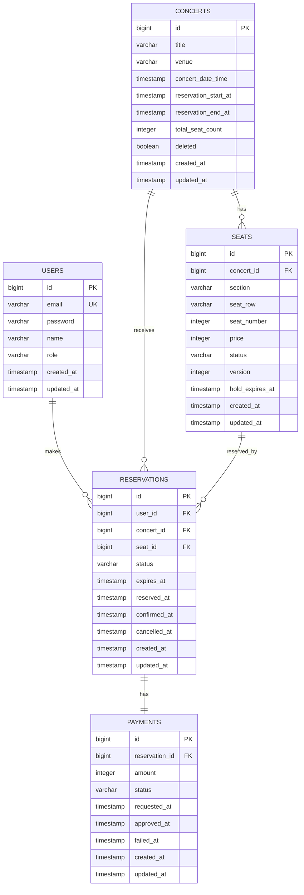

# 2단계. ERD 설계

## 1. 설계 목표

이 ERD는 콘서트 티켓 예매 시스템의 정합성과 동시성 제어를 중심으로 설계한다.

핵심 설계 목표는 다음과 같다.

- 같은 좌석이 중복 예매되지 않도록 DB 제약과 애플리케이션 락을 함께 사용한다.
- 좌석 상태와 예매 상태를 분리해 결제 전 HOLD, 결제 완료 RESERVED, 만료 EXPIRED 흐름을 명확히 표현한다.
- 대기열은 Redis 중심으로 관리하고, 영속 데이터는 PostgreSQL에 저장한다.
- 동시성 테스트와 부하 테스트에서 검증 가능한 인덱스와 제약 조건을 둔다.

## 2. 전체 엔티티 관계



## 3. 테이블 목록

| 테이블 | 설명 |
| --- | --- |
| users | 회원 및 관리자 계정 |
| concerts | 공연 정보 |
| seats | 공연별 좌석 |
| reservations | 좌석 예매 정보 |
| payments | Mock 결제 정보 |

WaitingToken은 Redis에서 관리하므로 별도 RDB 테이블로 만들지 않는다. 단, 발표나 실험 기록을 위해 대기열 입장 로그가 필요해지면 `waiting_room_logs` 테이블을 추가할 수 있다.

## 4. users

### 목적

회원 인증과 권한 관리를 담당한다.

### 컬럼

| 컬럼 | 타입 | 제약 | 설명 |
| --- | --- | --- | --- |
| id | BIGSERIAL | PK | 사용자 ID |
| email | VARCHAR(255) | NOT NULL, UNIQUE | 로그인 이메일 |
| password | VARCHAR(255) | NOT NULL | BCrypt 해시 비밀번호 |
| name | VARCHAR(100) | NOT NULL | 사용자 이름 |
| role | VARCHAR(20) | NOT NULL | USER, ADMIN |
| created_at | TIMESTAMP | NOT NULL | 생성 시간 |
| updated_at | TIMESTAMP | NOT NULL | 수정 시간 |

### 제약 조건

```sql
ALTER TABLE users
ADD CONSTRAINT uq_users_email UNIQUE (email);
```

### 인덱스

| 인덱스 | 컬럼 | 목적 |
| --- | --- | --- |
| uq_users_email | email | 로그인 및 중복 가입 방지 |

## 5. concerts

### 목적

공연 정보와 예매 가능 기간을 관리한다.

### 컬럼

| 컬럼 | 타입 | 제약 | 설명 |
| --- | --- | --- | --- |
| id | BIGSERIAL | PK | 공연 ID |
| title | VARCHAR(200) | NOT NULL | 공연명 |
| venue | VARCHAR(200) | NOT NULL | 공연장 |
| concert_date_time | TIMESTAMP | NOT NULL | 공연 일시 |
| reservation_start_at | TIMESTAMP | NOT NULL | 예매 시작 시간 |
| reservation_end_at | TIMESTAMP | NOT NULL | 예매 종료 시간 |
| total_seat_count | INTEGER | NOT NULL | 총 좌석 수 |
| deleted | BOOLEAN | NOT NULL DEFAULT false | 소프트 삭제 여부 |
| created_at | TIMESTAMP | NOT NULL | 생성 시간 |
| updated_at | TIMESTAMP | NOT NULL | 수정 시간 |

### 제약 조건

```sql
ALTER TABLE concerts
ADD CONSTRAINT ck_concerts_total_seat_count_positive
CHECK (total_seat_count > 0);

ALTER TABLE concerts
ADD CONSTRAINT ck_concerts_reservation_period
CHECK (reservation_start_at < reservation_end_at);
```

### 인덱스

| 인덱스 | 컬럼 | 목적 |
| --- | --- | --- |
| idx_concerts_reservation_period | reservation_start_at, reservation_end_at | 예매 가능 공연 조회 |
| idx_concerts_deleted | deleted | 삭제 제외 목록 조회 |

## 6. seats

### 목적

공연별 좌석과 좌석 점유 상태를 관리한다.

### 컬럼

| 컬럼 | 타입 | 제약 | 설명 |
| --- | --- | --- | --- |
| id | BIGSERIAL | PK | 좌석 ID |
| concert_id | BIGINT | NOT NULL, FK | 공연 ID |
| section | VARCHAR(50) | NOT NULL | 좌석 구역 |
| seat_row | VARCHAR(20) | NOT NULL | 좌석 열 |
| seat_number | INTEGER | NOT NULL | 좌석 번호 |
| price | INTEGER | NOT NULL | 가격 |
| status | VARCHAR(20) | NOT NULL | AVAILABLE, HOLD, RESERVED, CANCELLED |
| version | INTEGER | NOT NULL | 낙관적 락 버전 |
| hold_expires_at | TIMESTAMP | NULL | HOLD 만료 시간 |
| created_at | TIMESTAMP | NOT NULL | 생성 시간 |
| updated_at | TIMESTAMP | NOT NULL | 수정 시간 |

`row`는 SQL 예약어와 혼동될 수 있으므로 실제 컬럼명은 `seat_row`를 사용한다.

### 제약 조건

```sql
ALTER TABLE seats
ADD CONSTRAINT fk_seats_concert
FOREIGN KEY (concert_id) REFERENCES concerts(id);

ALTER TABLE seats
ADD CONSTRAINT uq_seats_position
UNIQUE (concert_id, section, seat_row, seat_number);

ALTER TABLE seats
ADD CONSTRAINT ck_seats_price_non_negative
CHECK (price >= 0);

ALTER TABLE seats
ADD CONSTRAINT ck_seats_status
CHECK (status IN ('AVAILABLE', 'HOLD', 'RESERVED', 'CANCELLED'));
```

### 인덱스

| 인덱스 | 컬럼 | 목적 |
| --- | --- | --- |
| uq_seats_position | concert_id, section, seat_row, seat_number | 공연 내 좌석 중복 방지 |
| idx_seats_concert_status | concert_id, status | 공연별 좌석 상태 조회 |
| idx_seats_hold_expires_at | hold_expires_at | HOLD 만료 좌석 조회 |

## 7. reservations

### 목적

사용자의 좌석 예매 상태를 관리한다.

### 컬럼

| 컬럼 | 타입 | 제약 | 설명 |
| --- | --- | --- | --- |
| id | BIGSERIAL | PK | 예매 ID |
| user_id | BIGINT | NOT NULL, FK | 사용자 ID |
| concert_id | BIGINT | NOT NULL, FK | 공연 ID |
| seat_id | BIGINT | NOT NULL, FK | 좌석 ID |
| status | VARCHAR(20) | NOT NULL | PENDING, CONFIRMED, CANCELLED, EXPIRED |
| expires_at | TIMESTAMP | NOT NULL | 결제 만료 시간 |
| reserved_at | TIMESTAMP | NOT NULL | 예매 생성 시간 |
| confirmed_at | TIMESTAMP | NULL | 예매 확정 시간 |
| cancelled_at | TIMESTAMP | NULL | 취소 시간 |
| created_at | TIMESTAMP | NOT NULL | 생성 시간 |
| updated_at | TIMESTAMP | NOT NULL | 수정 시간 |

### 제약 조건

```sql
ALTER TABLE reservations
ADD CONSTRAINT fk_reservations_user
FOREIGN KEY (user_id) REFERENCES users(id);

ALTER TABLE reservations
ADD CONSTRAINT fk_reservations_concert
FOREIGN KEY (concert_id) REFERENCES concerts(id);

ALTER TABLE reservations
ADD CONSTRAINT fk_reservations_seat
FOREIGN KEY (seat_id) REFERENCES seats(id);

ALTER TABLE reservations
ADD CONSTRAINT ck_reservations_status
CHECK (status IN ('PENDING', 'CONFIRMED', 'CANCELLED', 'EXPIRED'));
```

### 핵심 Partial Unique Index

동일 좌석에 활성 예매가 여러 개 생기지 않도록 DB 레벨의 마지막 방어선을 둔다.

```sql
CREATE UNIQUE INDEX uq_reservations_active_seat
ON reservations (seat_id)
WHERE status IN ('PENDING', 'CONFIRMED');
```

같은 사용자가 같은 좌석에 대해 활성 예매를 중복 생성하는 것도 방지한다.

```sql
CREATE UNIQUE INDEX uq_reservations_active_user_seat
ON reservations (user_id, seat_id)
WHERE status IN ('PENDING', 'CONFIRMED');
```

### 인덱스

| 인덱스 | 컬럼 | 목적 |
| --- | --- | --- |
| uq_reservations_active_seat | seat_id where active | 좌석 중복 예매 방지 |
| uq_reservations_active_user_seat | user_id, seat_id where active | 사용자 중복 예매 방지 |
| idx_reservations_user_created_at | user_id, created_at | 내 예매 내역 조회 |
| idx_reservations_concert_status | concert_id, status | 공연별 예매 현황 조회 |
| idx_reservations_pending_expires_at | status, expires_at | 만료 대상 조회 |

## 8. payments

### 목적

Mock 결제 요청과 결과를 관리한다.

### 컬럼

| 컬럼 | 타입 | 제약 | 설명 |
| --- | --- | --- | --- |
| id | BIGSERIAL | PK | 결제 ID |
| reservation_id | BIGINT | NOT NULL, FK, UNIQUE | 예매 ID |
| amount | INTEGER | NOT NULL | 결제 금액 |
| status | VARCHAR(20) | NOT NULL | PENDING, SUCCESS, FAILED, TIMEOUT |
| requested_at | TIMESTAMP | NOT NULL | 결제 요청 시간 |
| approved_at | TIMESTAMP | NULL | 결제 승인 시간 |
| failed_at | TIMESTAMP | NULL | 결제 실패 시간 |
| created_at | TIMESTAMP | NOT NULL | 생성 시간 |
| updated_at | TIMESTAMP | NOT NULL | 수정 시간 |

### 제약 조건

```sql
ALTER TABLE payments
ADD CONSTRAINT fk_payments_reservation
FOREIGN KEY (reservation_id) REFERENCES reservations(id);

ALTER TABLE payments
ADD CONSTRAINT uq_payments_reservation
UNIQUE (reservation_id);

ALTER TABLE payments
ADD CONSTRAINT ck_payments_amount_non_negative
CHECK (amount >= 0);

ALTER TABLE payments
ADD CONSTRAINT ck_payments_status
CHECK (status IN ('PENDING', 'SUCCESS', 'FAILED', 'TIMEOUT'));
```

### 인덱스

| 인덱스 | 컬럼 | 목적 |
| --- | --- | --- |
| uq_payments_reservation | reservation_id | 예매당 결제 1개 보장 |
| idx_payments_status_created_at | status, created_at | 결제 상태별 조회 |

## 9. 상태 전이

### Seat 상태 전이

```text
AVAILABLE -> HOLD
HOLD -> RESERVED
HOLD -> AVAILABLE
RESERVED -> AVAILABLE
AVAILABLE -> CANCELLED
```

의미:

- `AVAILABLE -> HOLD`: 예매 생성 성공, 결제 대기
- `HOLD -> RESERVED`: 결제 성공
- `HOLD -> AVAILABLE`: 결제 실패 또는 만료
- `RESERVED -> AVAILABLE`: 예매 취소
- `AVAILABLE -> CANCELLED`: 관리자에 의한 좌석 비활성화

### Reservation 상태 전이

```text
PENDING -> CONFIRMED
PENDING -> CANCELLED
PENDING -> EXPIRED
CONFIRMED -> CANCELLED
```

의미:

- `PENDING -> CONFIRMED`: 결제 성공
- `PENDING -> CANCELLED`: 사용자 취소 또는 결제 실패
- `PENDING -> EXPIRED`: 결제 시간 초과
- `CONFIRMED -> CANCELLED`: 확정 예매 취소

### Payment 상태 전이

```text
PENDING -> SUCCESS
PENDING -> FAILED
PENDING -> TIMEOUT
```

## 10. Redis 설계

대기열과 입장 토큰은 Redis에 저장한다. Redis 데이터는 영속 데이터의 원천이 아니라 트래픽 제어와 임시 권한 검증을 위한 데이터다.

### Key 목록

| 목적 | Key | Type | TTL |
| --- | --- | --- | --- |
| 공연별 대기열 | `waiting:{concertId}:queue` | Sorted Set | 없음 또는 운영 정책 |
| 사용자 토큰 매핑 | `waiting:{concertId}:user:{userId}` | String | 예매 종료까지 |
| 입장 허용 토큰 | `waiting:{concertId}:allowed:{token}` | String | 5분 |
| 사용 완료 토큰 | `waiting:{concertId}:used:{token}` | String | 10분 |
| 대기열 설정 | `waiting:{concertId}:config` | Hash | 없음 |
| 좌석 분산락 | `lock:seat:{seatId}` | String | 3초에서 10초 |
| 대기열 통계 | `metrics:waiting:{concertId}:length` | String 또는 Gauge | 짧은 TTL |

### Sorted Set 설계

```text
Key: waiting:{concertId}:queue
Member: waiting token
Score: issued timestamp millis or increasing sequence
```

순번 조회:

```text
ZRANK waiting:{concertId}:queue {token}
```

입장 허용:

```text
ZRANGE waiting:{concertId}:queue 0 {limit - 1}
```

입장 처리:

```text
ZREM waiting:{concertId}:queue {token}
SET waiting:{concertId}:allowed:{token} {userId} EX 300
```

### 분산락 설계

```text
Key: lock:seat:{seatId}
Value: unique lock owner id
TTL: 3초에서 10초
```

락 획득:

```text
SET lock:seat:{seatId} {ownerId} NX PX 3000
```

락 해제:

락 소유자가 일치하는 경우에만 삭제한다. 원자성을 위해 Lua Script를 사용한다.

```lua
if redis.call("GET", KEYS[1]) == ARGV[1] then
    return redis.call("DEL", KEYS[1])
else
    return 0
end
```

## 11. JPA 연관관계 방향

### 기본 원칙

- 핵심 조회는 Repository 쿼리로 명확하게 작성한다.
- 컬렉션 양방향 매핑은 꼭 필요한 경우만 사용한다.
- 예매 생성 경로에서는 Seat를 명시적으로 조회하고 상태를 변경한다.
- N+1이 우려되는 목록 조회는 fetch join 또는 DTO projection으로 처리한다.

### 권장 매핑

| 엔티티 | 관계 | 권장 방향 |
| --- | --- | --- |
| Seat -> Concert | ManyToOne | 단방향 |
| Reservation -> User | ManyToOne | 단방향 |
| Reservation -> Concert | ManyToOne | 단방향 |
| Reservation -> Seat | ManyToOne | 단방향 |
| Payment -> Reservation | OneToOne | 단방향 |

Concert에서 seats 컬렉션을 직접 들고 있지 않아도 된다. 공연별 좌석 조회는 `SeatRepository.findByConcertId(...)` 형태로 처리한다.

## 12. 동시성 제어를 위한 Repository 쿼리 후보

### 일반 조회

```java
Optional<Seat> findById(Long seatId);
```

### 비관적 락 조회

```java
@Lock(LockModeType.PESSIMISTIC_WRITE)
@Query("select s from Seat s where s.id = :seatId")
Optional<Seat> findByIdForUpdate(@Param("seatId") Long seatId);
```

### 낙관적 락

Seat 엔티티에 `@Version` 필드를 둔다.

```java
@Version
private Long version;
```

### 만료 예매 조회

```java
@Query("""
    select r
    from Reservation r
    where r.status = 'PENDING'
      and r.expiresAt < :now
""")
List<Reservation> findExpiredPendingReservations(@Param("now") LocalDateTime now);
```

## 13. 정합성 검증 쿼리

부하 테스트 또는 동시성 테스트 후 다음 쿼리로 중복 예매 여부를 확인할 수 있다.

### 좌석별 활성 예매 수

```sql
SELECT seat_id, COUNT(*) AS active_count
FROM reservations
WHERE status IN ('PENDING', 'CONFIRMED')
GROUP BY seat_id
HAVING COUNT(*) > 1;
```

결과가 없어야 한다.

### 좌석 상태와 예매 상태 불일치

```sql
SELECT s.id AS seat_id, s.status AS seat_status, r.id AS reservation_id, r.status AS reservation_status
FROM seats s
LEFT JOIN reservations r
  ON r.seat_id = s.id
 AND r.status IN ('PENDING', 'CONFIRMED')
WHERE (s.status = 'HOLD' AND r.status <> 'PENDING')
   OR (s.status = 'RESERVED' AND r.status <> 'CONFIRMED');

```

alias

결과가 없어야 한다.

## 14. DDL 초안

실제 프로젝트에서는 Flyway 또는 Liquibase를 붙일 수 있다. 초기 구현에서는 JPA `ddl-auto=create`로 시작해도 되지만, 캡스톤 산출물에는 DDL을 명확히 남기는 편이 좋다.

```sql
CREATE TABLE users (
    id BIGSERIAL PRIMARY KEY,
    email VARCHAR(255) NOT NULL UNIQUE,
    password VARCHAR(255) NOT NULL,
    name VARCHAR(100) NOT NULL,
    role VARCHAR(20) NOT NULL,
    created_at TIMESTAMP NOT NULL,
    updated_at TIMESTAMP NOT NULL
);

CREATE TABLE concerts (
    id BIGSERIAL PRIMARY KEY,
    title VARCHAR(200) NOT NULL,
    venue VARCHAR(200) NOT NULL,
    concert_date_time TIMESTAMP NOT NULL,
    reservation_start_at TIMESTAMP NOT NULL,
    reservation_end_at TIMESTAMP NOT NULL,
    total_seat_count INTEGER NOT NULL,
    deleted BOOLEAN NOT NULL DEFAULT false,
    created_at TIMESTAMP NOT NULL,
    updated_at TIMESTAMP NOT NULL,
    CONSTRAINT ck_concerts_total_seat_count_positive CHECK (total_seat_count > 0),
    CONSTRAINT ck_concerts_reservation_period CHECK (reservation_start_at < reservation_end_at)
);

CREATE TABLE seats (
    id BIGSERIAL PRIMARY KEY,
    concert_id BIGINT NOT NULL REFERENCES concerts(id),
    section VARCHAR(50) NOT NULL,
    seat_row VARCHAR(20) NOT NULL,
    seat_number INTEGER NOT NULL,
    price INTEGER NOT NULL,
    status VARCHAR(20) NOT NULL,
    version INTEGER NOT NULL,
    hold_expires_at TIMESTAMP NULL,
    created_at TIMESTAMP NOT NULL,
    updated_at TIMESTAMP NOT NULL,
    CONSTRAINT uq_seats_position UNIQUE (concert_id, section, seat_row, seat_number),
    CONSTRAINT ck_seats_price_non_negative CHECK (price >= 0),
    CONSTRAINT ck_seats_status CHECK (status IN ('AVAILABLE', 'HOLD', 'RESERVED', 'CANCELLED'))
);

CREATE TABLE reservations (
    id BIGSERIAL PRIMARY KEY,
    user_id BIGINT NOT NULL REFERENCES users(id),
    concert_id BIGINT NOT NULL REFERENCES concerts(id),
    seat_id BIGINT NOT NULL REFERENCES seats(id),
    status VARCHAR(20) NOT NULL,
    expires_at TIMESTAMP NOT NULL,
    reserved_at TIMESTAMP NOT NULL,
    confirmed_at TIMESTAMP NULL,
    cancelled_at TIMESTAMP NULL,
    created_at TIMESTAMP NOT NULL,
    updated_at TIMESTAMP NOT NULL,
    CONSTRAINT ck_reservations_status CHECK (status IN ('PENDING', 'CONFIRMED', 'CANCELLED', 'EXPIRED'))
);

CREATE TABLE payments (
    id BIGSERIAL PRIMARY KEY,
    reservation_id BIGINT NOT NULL UNIQUE REFERENCES reservations(id),
    amount INTEGER NOT NULL,
    status VARCHAR(20) NOT NULL,
    requested_at TIMESTAMP NOT NULL,
    approved_at TIMESTAMP NULL,
    failed_at TIMESTAMP NULL,
    created_at TIMESTAMP NOT NULL,
    updated_at TIMESTAMP NOT NULL,
    CONSTRAINT ck_payments_amount_non_negative CHECK (amount >= 0),
    CONSTRAINT ck_payments_status CHECK (status IN ('PENDING', 'SUCCESS', 'FAILED', 'TIMEOUT'))
);

CREATE INDEX idx_concerts_reservation_period
ON concerts (reservation_start_at, reservation_end_at);

CREATE INDEX idx_concerts_deleted
ON concerts (deleted);

CREATE INDEX idx_seats_concert_status
ON seats (concert_id, status);

CREATE INDEX idx_seats_hold_expires_at
ON seats (hold_expires_at);

CREATE UNIQUE INDEX uq_reservations_active_seat
ON reservations (seat_id)
WHERE status IN ('PENDING', 'CONFIRMED');

CREATE UNIQUE INDEX uq_reservations_active_user_seat
ON reservations (user_id, seat_id)
WHERE status IN ('PENDING', 'CONFIRMED');

CREATE INDEX idx_reservations_user_created_at
ON reservations (user_id, created_at);

CREATE INDEX idx_reservations_concert_status
ON reservations (concert_id, status);

CREATE INDEX idx_reservations_pending_expires_at
ON reservations (status, expires_at);

CREATE INDEX idx_payments_status_created_at
ON payments (status, created_at);
```

## 15. 설계 결정 요약

- WaitingToken은 PostgreSQL 테이블로 만들지 않고 Redis에서 관리한다.
- 좌석 중복 예매 방지는 애플리케이션 락만 믿지 않고 PostgreSQL partial unique index를 함께 둔다.
- Seat에는 낙관적 락 실험을 위해 version 필드를 둔다.
- Reservation은 결제 전 PENDING 상태로 생성하고, 결제 성공 후 CONFIRMED가 된다.
- Seat는 예매 생성 시 HOLD, 결제 성공 시 RESERVED, 결제 실패 또는 만료 시 AVAILABLE로 전이된다.
- 공연 삭제는 실제 삭제보다 `deleted` 필드를 이용한 소프트 삭제를 우선 고려한다.

## 16. 다음 단계

3단계에서는 API 명세를 작성한다.

다음 항목을 정의한다.

- API별 HTTP method와 path
- 인증 필요 여부
- 관리자 권한 필요 여부
- 요청 DTO
- 응답 DTO
- 에러 코드
- 공통 응답 형식
